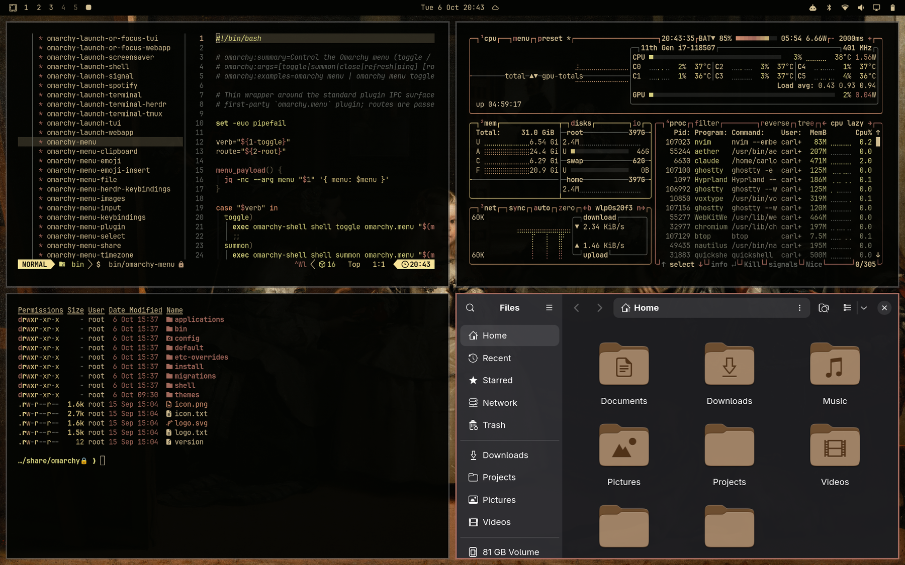
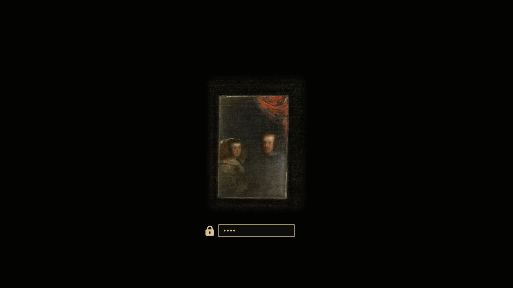

# Las Meninas — Omarchy theme

*[Español](#español) · [English](#english)*



---

## Español

Yo, Dalí, os lo digo: Velázquez es el pintor más grande de todos los tiempos, y *Las Meninas* es su milagro. Velázquez no pintó personas: pintó el aire que hay entre ellas. Ese aire espeso y dorado que flota sobre la cabeza de la Infanta y se disuelve en la penumbra del techo es la materia más preciosa jamás depositada sobre un lienzo, ¡más preciosa que el oro de los Austrias!

Ahora ese aire entra en vuestra máquina. El negro del obrador se convierte en vuestras ventanas; la plata de los vestidos reluce como mercurio en vuestras letras; y el bermellón de los lazos de la Infanta, una gota de sangre real en mitad de la noche, os señala dónde está vuestra atención. Y no olvidéis el espejo del fondo: el Rey y la Reina os observan mientras trabajáis. Como en el cuadro, el espectador sois vosotros.

*Texto escrito a la manera de Salvador Dalí, admirador devoto de Velázquez. No es una cita suya.*

Un tema oscuro para [Omarchy](https://omarchy.org) basado en *Las Meninas* (1656), Museo del Prado.

También existe una versión clara: [Las Meninas (claro)](https://github.com/carloschida/omarchy-las-meninas-light-theme).

### Instalación

```bash
omarchy theme install https://github.com/carloschida/omarchy-las-meninas-theme
```

Después, elígelo en el selector de temas o ejecuta `omarchy theme set las-meninas`.

### Fondos de pantalla

Ocho encuadres de la pintura en 4K (3840 × 2400), recortados del escaneo en gigapíxeles del Museo del Prado:

1. La familia de Felipe IV
2. Velázquez, la Infanta y el espejo
3. El espejo de los Reyes y José Nieto
4. El aire y el lienzo
5. El autorretrato de Velázquez
6. Mari Bárbola y Nicolasito Pertusato
7. El mastín
8. Isabel de Velasco y los guardadamas

Los fondos son 16:10 y están compuestos para que nada importante se pierda en pantallas 16:9: caras y detalles quedan dentro del 90 % central de la altura. Cambia de fondo con `omarchy theme bg next`.

### Extras

- **Pantalla de desbloqueo** (`unlock.png`): el espejo con el reflejo de Felipe IV y Mariana de Austria. Actívala con `omarchy plymouth set by theme las-meninas`.
- **Teclado RGB** (`keyboard.rgb`): el bermellón de los lazos de la Infanta, para portátiles compatibles.



### Créditos y licencia

*Las Meninas*, Diego Velázquez, 1656. Óleo sobre lienzo, 318 × 276 cm. Museo del Prado, Madrid.
Imágenes a partir del escaneo de [Wikimedia Commons](https://commons.wikimedia.org/wiki/File:Las_Meninas,_by_Diego_Vel%C3%A1zquez,_from_Prado_in_Google_Earth.jpg) (Prado en Google Earth). La obra y sus reproducciones fieles son de **dominio público**.

Los archivos del tema (colores, configuración y este README) se publican bajo la [licencia MIT](LICENSE). Las imágenes no están sujetas a esa licencia: son de dominio público.

---

## English

I, Dalí, tell you this: Velázquez is the greatest painter of all time, and *Las Meninas* is his miracle. Velázquez did not paint people: he painted the air between them. That thick, golden air floating above the Infanta's head and dissolving into the gloom of the ceiling is the most precious substance ever laid upon a canvas, more precious than all the gold of the Habsburgs!

Now that air enters your machine. The black of the studio becomes your windows; the silver of the dresses gleams like mercury in your letters; and the vermilion of the Infanta's ribbons, a drop of royal blood in the middle of the night, shows you where your attention lies. And do not forget the mirror at the back: the King and Queen are watching you work. As in the painting, the viewer is you.

*Written in the manner of Salvador Dalí, a devoted admirer of Velázquez. Not a quotation of his.*

A dark theme for [Omarchy](https://omarchy.org) based on *Las Meninas* (1656), Museo del Prado.

There is also a light version: [Las Meninas (light)](https://github.com/carloschida/omarchy-las-meninas-light-theme).

### Installation

```bash
omarchy theme install https://github.com/carloschida/omarchy-las-meninas-theme
```

Then pick it in the theme switcher or run `omarchy theme set las-meninas`.

### Wallpapers

Eight crops of the painting in 4K (3840 × 2400), cut from the Museo del Prado's gigapixel scan. Titles are in Spanish:

1. La familia de Felipe IV — *The Family of Philip IV*
2. Velázquez, la Infanta y el espejo — *Velázquez, the Infanta and the mirror*
3. El espejo de los Reyes y José Nieto — *The King and Queen's mirror and José Nieto*
4. El aire y el lienzo — *The air and the canvas*
5. El autorretrato de Velázquez — *Velázquez's self-portrait*
6. Mari Bárbola y Nicolasito Pertusato — *Mari Bárbola and Nicolasito Pertusato*
7. El mastín — *The mastiff*
8. Isabel de Velasco y los guardadamas — *Isabel de Velasco and the chaperones*

The wallpapers are 16:10 and composed so nothing important is lost on 16:9 screens: faces and details stay inside the middle 90% of the height. Cycle through them with `omarchy theme bg next`.

### Extras

- **Unlock screen** (`unlock.png`): the mirror with the reflection of Philip IV and Mariana of Austria. Enable it with `omarchy plymouth set by theme las-meninas`.
- **RGB keyboard** (`keyboard.rgb`): the vermilion of the Infanta's ribbons, for supported laptops.

### Credits and license

*Las Meninas*, Diego Velázquez, 1656. Oil on canvas, 318 × 276 cm. Museo del Prado, Madrid.
Images from the [Wikimedia Commons](https://commons.wikimedia.org/wiki/File:Las_Meninas,_by_Diego_Vel%C3%A1zquez,_from_Prado_in_Google_Earth.jpg) scan (Prado in Google Earth). The painting and faithful reproductions of it are in the **public domain**.

The theme files (colours, configuration and this README) are released under the [MIT License](LICENSE). The images are not covered by that license: they are in the public domain.
